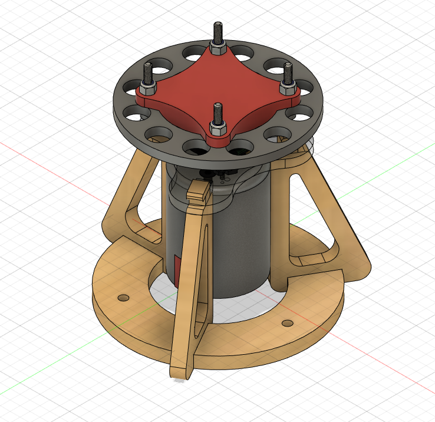
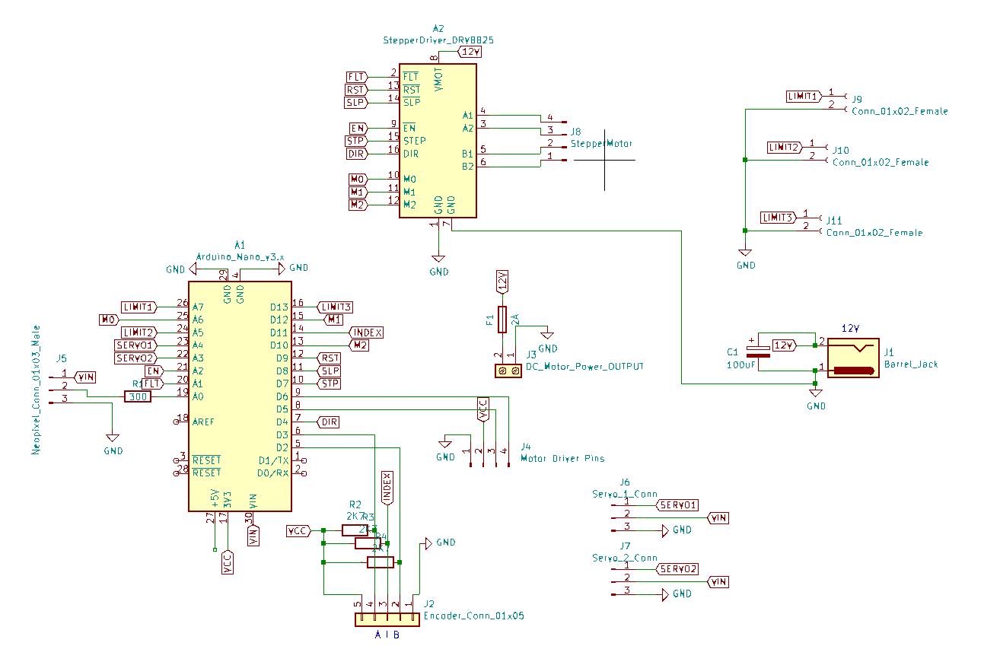

# spinner-nidec
Spinner experiment with nidec motor (spoiler alert - contains friction!) 

WARNING: This repository contains the prototype version of the Spinning Disk remote lab.
You are recommended to use the updated version available at [spinner-amax](https://github.com/practable/spinner-amax).

The PCB files are for a version of the PCB intended to work for a number of different hardware setups 
and therefore does not represent the best design for the Spinning Disk alone. [spinner-amax](https://github.com/practable/spinner-amax) 
contains an updated PCB design.

